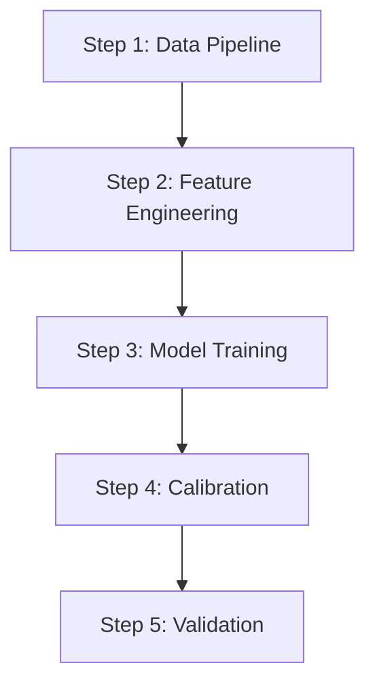

# Research ADE v5.0 - Implementation Plan

## Executive Summary

This document outlines the complete redesign of Research ADE from v4.0 to v5.0. The fundamental shift is from an **assessment-oriented** system ("Is this feasible?") to an **implementation-oriented** system ("How do we build this?").

**Key Changes:**
1. New default posture: "Solutions exist until proven otherwise" (Optimistic-Empirical)
2. Mandatory PLAN phase before research begins
3. Counterevidence restructured as Failure Studies + Risk-Mitigation Pairs
4. HIGH confidence required for final recommendations (or explicit gap declaration)
5. New SPECIFICATION deliverable type for implementation guidance
6. Research ends with definitive answers, not feasibility assessments

---

## 1. Philosophical Redesign

### 1.1 From Assessment to Engineering

**v4.0 (Current):** "Should we build this?" → Feasibility assessment
**v5.0 (New):** "How do we build this?" → Implementation specification

The system now assumes the user wants to accomplish something that has been done before (or is technically possible). Research focuses on finding **how others solved similar problems** and synthesizing the best approach.

### 1.2 Default Assumption: Optimistic-Empirical

```
POSTURE: "Solutions exist until proven otherwise"

FALLBACK: If truly novel → Transition to frontier synthesis
          If proven infeasible → Document why with evidence
```

### 1.3 Research Completion Criteria

Research ONLY ends when:
1. **HIGH confidence achieved** on recommended approach, OR
2. **Explicit gap declaration** with specific unknowns documented

No more "feasible under narrow conditions" conclusions. Either we know how to do it, or we document exactly what's missing.

---

## 2. New Phase Structure

### 2.1 Phase Overview (8 Phases)

```
Phase 0: PLAN       Comprehensive research plan before execution
Phase 1: PARSE      Parse SPEC, validate, initialize state
Phase 2: SURVEY     Broad discovery pass (breadth-first)
Phase 3: DEEP DIVE  Evidence-driven depth allocation
Phase 4: FAILURE    Failure studies + risk-mitigation pairs
Phase 5: COMPILE    Build claims registry, enforce gates
Phase 6: SPECIFY    Generate implementation specification
Phase 7: VALIDATE   Self-assess, ensure HIGH confidence met
```

### 2.2 Phase 0: PLAN (New - Mandatory)

**Objective:** Create comprehensive research plan before any discovery.

**Inputs:**
- User's goal/question
- Domain context

**Process:**
1. Analyze the user's goal
2. Decompose into research questions
3. Identify prior art search strategies
4. Define success criteria (what HIGH confidence looks like)
5. Anticipate potential sub-domains
6. Create research unit structure
7. Define key search terms and variants

**Outputs:**
- `research/{slug}/PLAN.md` - Research plan for user review
- Initial SPEC.md draft
- Estimated research scope

**Critical:** User must approve PLAN before research proceeds.

### 2.3 Phase 2: SURVEY (Renamed from DISCOVER)

**Objective:** Broad discovery to understand the landscape.

**Key Changes from v4.0:**
- Focus on "how did others solve this?" not "is this solvable?"
- Prioritize implementation papers, technical reports, case studies
- Look for specific methods, not just existence claims

**Search Strategy:**
```
Primary: "{goal} implementation" "{goal} system design" "{goal} method"
Secondary: "{goal} architecture" "{goal} pipeline" "{goal} how to"
Tertiary: "state of the art {domain}" "best practices {domain}"
```

### 2.4 Phase 3: DEEP DIVE (New)

**Objective:** Evidence-driven depth allocation.

**Process:**
1. Review SURVEY results
2. Identify promising methods/approaches
3. Allocate depth based on:
   - Source quality (prefer FULLTEXT T1/2)
   - Implementation detail availability
   - Validation evidence present
4. Extract detailed implementation specifications
5. Compare approaches on concrete metrics

**Dynamic Allocation:**
```javascript
// Allocate more depth to units with implementation detail
for each research_unit:
  if has_implementation_papers >= 3:
    depth_allocation = 'deep'
  else if has_implementation_papers >= 1:
    depth_allocation = 'medium'
  else:
    // Flag for additional search
    flag_needs_more_survey = true
```

### 2.5 Phase 4: FAILURE ANALYSIS (Restructured from Counterevidence)

**Objective:** Find failure studies and extract risk-mitigation pairs.

**Old v4.0 Approach:**
- "Find reasons this might not work"
- Creates defensive, hedging output

**New v5.0 Approach:**
- "Find implementations that failed and WHY"
- "Extract what they learned"
- "Pair risks with mitigations from literature"

**Search Strategy:**
```
Primary: "{method} failed" "{method} pitfalls" "{method} lessons learned"
Secondary: "{method} mistakes" "{method} what went wrong"
Tertiary: "{domain} postmortem" "{domain} failure analysis"
```

**Output Format:**
```markdown
## Failure Study: {paper/report}

### What They Tried
- Method: {specific approach}
- Context: {conditions}

### What Failed
- Failure Mode: {what went wrong}
- Root Cause: {why it failed}

### Lessons Learned
- {insight 1}
- {insight 2}

### Risk-Mitigation Pair
| Risk | Mitigation | Evidence |
|------|------------|----------|
| {risk from this failure} | {how to avoid} | {source} |
```

### 2.6 Phase 6: SPECIFY (Renamed from SYNTHESIZE)

**Objective:** Generate implementation specification, not feasibility report.

**Key Changes:**
- Output SPECIFICATION deliverable by default
- Include specific method recommendations
- Provide implementation order/dependencies
- Include risk-mitigation table from Phase 4

---

## 3. New SPEC Template

### 3.1 Updated SPEC.md Format

```markdown
# Research Specification: [Topic]

## Goal
<!-- REQUIRED: What you want to accomplish (not "is it possible") -->
Build/Design/Implement [specific outcome]

## Success Criteria
<!-- REQUIRED: What HIGH confidence looks like -->
- [ ] Specific method recommendations identified
- [ ] Implementation sequence defined
- [ ] Data requirements documented
- [ ] Known risks paired with mitigations
- [ ] Validation approach specified

## Research Units
<!-- REQUIRED: 1-5 focused areas -->
1. [Component/Method area 1]
2. [Component/Method area 2]
3. [Component/Method area 3]

## Deliverable
<!-- REQUIRED: Default is now SPECIFICATION -->
- **SPECIFICATION**: Implementation blueprint with method selections (DEFAULT)
- **VERDICT**: Choose between specific alternatives
- **COMPARISON**: Neutral analysis of options
- **REPORT**: Comprehensive findings (use for "what is" questions)
- **BLUEPRINT**: Architecture design
- **BIBLIOGRAPHY**: Annotated sources

**Primary Deliverable**: SPECIFICATION

## Context
<!-- REQUIRED: Your specific situation -->
- **Use case**: [What you're building]
- **Constraints**: [Technical, budget, data limitations]
- **Expertise**: [Your team's background]
- **Existing work**: [What you've already tried or know]

## Prior Art Hints
<!-- OPTIONAL: Known starting points -->
- [Paper/system you know about]
- [Method you've heard of]
- [Domain expert to look for]

## Constraints
<!-- OPTIONAL -->
- Time period: [Default: last 5 years + foundational]
- Excluded: [What to skip]

## Recency Policy
<!-- OPTIONAL -->
**Recency**: scientific | fast_moving | historical
```

### 3.2 Key Differences from v4.0 SPEC

| Section | v4.0 | v5.0 |
|---------|------|------|
| **Primary Field** | Research Question | Goal |
| **Phrasing** | "Is it feasible...?" | "Build/Design/Implement..." |
| **Default Deliverable** | REPORT | SPECIFICATION |
| **Success Criteria** | None | Required |
| **Prior Art Hints** | None | Optional |

---

## 4. New SPECIFICATION Deliverable

### 4.1 SPECIFICATION Output Format

```markdown
# Implementation Specification: {goal}

## Executive Summary
{2-3 sentences on recommended approach}

**Confidence Level**: HIGH | (or explicit gaps listed)

## Recommended Architecture

### Component 1: {name}
**Selected Method**: {specific method name}
**Why This Method**:
- Evidence: {source citations}
- Performance: {metrics from literature}
- Alternatives Considered: {what else exists, why not chosen}

**Implementation Details**:
- Input: {what it needs}
- Output: {what it produces}
- Key Parameters: {configuration}
- Dependencies: {what must come first}

### Component 2: {name}
...

## Implementation Sequence



### Step 1: {name}
- **What**: {description}
- **Method**: {specific approach}
- **Evidence Basis**: {citations}
- **Estimated Effort**: {complexity indicator}

### Step 2: {name}
...

## Data Requirements

| Data Type | Source | Format | Update Frequency | Evidence |
|-----------|--------|--------|------------------|----------|
| {type} | {source} | {format} | {frequency} | {citation} |

## Risk-Mitigation Table

| Risk | Likelihood | Impact | Mitigation | Evidence |
|------|------------|--------|------------|----------|
| {risk from failure studies} | H/M/L | H/M/L | {specific mitigation} | {citation} |

## Validation Approach

### Recommended Metrics
| Metric | Target | Rationale | Evidence |
|--------|--------|-----------|----------|
| {metric} | {target value} | {why this target} | {citation} |

### Testing Strategy
1. {validation step 1}
2. {validation step 2}

## Known Limitations

### What This Specification Covers
- {in scope}

### What Requires Additional Research
- {gap 1}: {what's unknown, why}
- {gap 2}: {what's unknown, why}

## Sources

### Primary (HIGH confidence basis)
| # | Title | Year | Access | Relevance |
|---|-------|------|--------|-----------|
| S1 | {title} | {year} | FULLTEXT | {how used} |

### Supporting
| # | Title | Year | Access | Relevance |
|---|-------|------|--------|-----------|

### Failure Studies Consulted
| # | Title | Year | Key Lesson |
|---|-------|------|------------|
```

---

## 5. Updated STATE.json Schema

### 5.1 New Schema

```json
{
  "version": "3.0",
  "slug": "{slug}",
  "preset": "standard",
  "posture": "optimistic-empirical",
  "min_sources_per_unit": 3,
  "extraction_depth": "medium",
  "tier_targets": {
    "academic": 70,
    "practitioner": 25,
    "other": 5
  },
  "research_units": [],
  "deliverable": "SPECIFICATION",
  "phase": "plan",
  "started_at": null,
  "completed_at": null,
  "plan_approved": false,
  "config": {
    "recency_policy": "scientific",
    "max_age_years": 5,
    "foundational_exception": true,
    "snowball": {
      "enabled": true,
      "max_seeds_per_unit": 5,
      "max_snowball_sources": 10
    },
    "grey_literature": false,
    "structured_extraction": true,
    "failure_analysis": true
  },
  "gates": {
    "depth_gate": {
      "required_fulltext": 2,
      "status": "pending"
    },
    "completion_gate": {
      "requires_high_confidence": true,
      "status": "pending",
      "gaps_declared": []
    },
    "retraction_gate": {
      "status": "pending"
    }
  },
  "statistics": {
    "sources_found": 0,
    "sources_deduplicated": 0,
    "fulltext_resolved": 0,
    "abstract_only": 0,
    "paywalled": 0,
    "retractions_found": 0,
    "snowball_added": 0,
    "failure_studies_found": 0,
    "risk_mitigation_pairs": 0
  },
  "confidence_tracking": {
    "high_confidence_claims": 0,
    "low_confidence_claims": 0,
    "gaps_requiring_research": []
  }
}
```

### 5.2 Key Schema Changes

| Field | v4.0 | v5.0 |
|-------|------|------|
| `posture` | N/A | `"optimistic-empirical"` |
| `deliverable` default | `"REPORT"` | `"SPECIFICATION"` |
| `plan_approved` | N/A | Required boolean |
| `completion_gate` | N/A | Replaces `safety_gate` |
| `failure_analysis` | N/A | Boolean, default true |
| `confidence_tracking` | N/A | New tracking block |

---

## 6. Updated Gates

### 6.1 Gate Changes

| Gate | v4.0 | v5.0 |
|------|------|------|
| **Depth Gate (A)** | Unchanged | Unchanged |
| **Safety Gate (B)** | Counterevidence required | REMOVED (replaced) |
| **Completion Gate** | N/A | HIGH confidence or explicit gaps |
| **Retraction Gate (C)** | Unchanged | Unchanged |

### 6.2 New Completion Gate

**Purpose:** Ensure research produces actionable output.

**Requirements:**
1. All method recommendations have HIGH confidence, OR
2. Gaps explicitly declared with:
   - What is unknown
   - Why it matters
   - What additional research would resolve it

**Enforcement:**
```javascript
function checkCompletionGate(claims, deliverable) {
  const recommendations = claims.filter(c => c.type === 'recommendation')
  const highConfidence = recommendations.filter(c => c.confidence === 'HIGH')

  if (highConfidence.length === recommendations.length) {
    return { status: 'passed', reason: 'all_high_confidence' }
  }

  const lowConfidence = recommendations.filter(c => c.confidence === 'LOW')
  const gapsDocumented = lowConfidence.every(c => c.gap_declaration !== null)

  if (gapsDocumented) {
    return {
      status: 'passed',
      reason: 'gaps_declared',
      gaps: lowConfidence.map(c => c.gap_declaration)
    }
  }

  return {
    status: 'failed',
    reason: 'low_confidence_without_gaps',
    blocking_claims: lowConfidence.filter(c => !c.gap_declaration)
  }
}
```

---

## 7. Files to Modify

### 7.1 Primary Files

| File | Changes Required |
|------|------------------|
| `.claude/CLAUDE.md` | Complete rewrite (see Section 8) |
| `.claude/rules/research.md` | Update schemas, add SPECIFICATION (see Section 9) |
| `.claude/commands/research.md` | Update phase definitions (see Section 10) |
| `templates/SPEC.md` | New format (see Section 3) |
| `README.md` | Update documentation (see Section 11) |

### 7.2 New Files to Create

| File | Purpose |
|------|---------|
| `templates/PLAN.md` | Research plan template |
| `.claude/commands/research-plan.md` | Plan phase command |

### 7.3 Files to Update

| File | Changes |
|------|---------|
| `.claude/commands/research-status.md` | Add plan status, completion gate |
| `.claude/commands/research-resume.md` | Handle plan phase |
| `.claude/commands/research-validate.md` | Add completion gate validation |

---

## 8. CLAUDE.md Rewrite

### 8.1 New Overview

```markdown
# Research ADE v5.0 - Project Constitution

## Overview

**Research ADE** is an autonomous research system that produces **implementation-ready specifications** through systematic evidence gathering. The system uses MCP tools to search academic databases, preprint servers, and web resources.

**Core Philosophy:**
- **Optimistic-Empirical**: Solutions exist until proven otherwise
- **Implementation-Focused**: "How to build" not "is it possible"
- **HIGH Confidence Required**: Definitive answers or explicit gaps
- **Evidence-Based Recommendations**: Every method selection backed by sources

**Key Features:**
- 8-phase workflow with mandatory planning
- Implementation-oriented discovery
- Failure studies with risk-mitigation pairs
- Completion gate ensuring actionable output
- New SPECIFICATION deliverable type
```

### 8.2 New Principles

**Principle 1: Plan Before Research** (NEW)
```markdown
### Principle 1: Plan Before Research

**Rule**: Every research project begins with a comprehensive plan that the user approves.

**PLAN Phase Outputs:**
- Research strategy document
- Success criteria definition
- Anticipated sub-domains
- Search term variations

**Why This Matters:**
- Prevents research drift
- Ensures alignment with user goals
- Enables targeted, efficient discovery
```

**Principle 2: Implementation Over Assessment** (NEW)
```markdown
### Principle 2: Implementation Over Assessment

**Rule**: Default posture is "How do we build this?" not "Is this feasible?"

**Discovery Focus:**
- Prioritize implementation papers
- Extract specific methods and parameters
- Find validation metrics and baselines
- Gather architectural patterns

**Avoid:**
- Feasibility hedging
- "It depends" conclusions
- Listing possibilities without selection
```

**Principle 3: Failure Studies, Not Counterevidence** (REPLACES old Principle 4)
```markdown
### Principle 3: Failure Studies as Learning

**Rule**: Counterevidence is reframed as failure analysis with risk-mitigation pairs.

**Old Approach (v4.0):**
- "Find reasons this might not work"
- Creates defensive output

**New Approach (v5.0):**
- "Find implementations that failed"
- "Extract lessons learned"
- "Pair each risk with a mitigation"

**Output Format:**
- Risk: {specific failure mode}
- Mitigation: {how to prevent/handle}
- Evidence: {source documenting this}
```

**Principle 4: HIGH Confidence or Explicit Gaps** (REPLACES old Safety Gate)
```markdown
### Principle 4: HIGH Confidence or Explicit Gaps

**Rule**: Research ONLY ends when:
1. All recommendations have HIGH confidence, OR
2. Gaps are explicitly declared with clear documentation

**Gap Declaration Format:**
```markdown
## Gap: {what is unknown}
- **Impact**: {why this matters}
- **Blocking**: {what can't be determined without this}
- **Resolution Path**: {what research would fill this gap}
```

**Completion Gate enforces this before synthesis.**
```

---

## 9. rules/research.md Updates

### 9.1 New SPECIFICATION Schema

Add to Deliverable Formats section:

```markdown
### SPECIFICATION (implementation guidance)

```markdown
# Implementation Specification: {goal}

## Executive Summary
{approach overview}
**Confidence Level**: HIGH | (gaps listed)

## Recommended Architecture
### Component 1: {name}
**Selected Method**: {method}
**Evidence Basis**: {citations}
**Implementation Details**: {specifics}

## Implementation Sequence
{ordered steps with dependencies}

## Data Requirements
{table of data needs}

## Risk-Mitigation Table
{failure-derived risks with mitigations}

## Validation Approach
{metrics and testing strategy}

## Known Limitations
{explicit gaps if any}

## Sources
{categorized by confidence contribution}
```

### 9.2 Updated Confidence Calculation

```javascript
function calculateConfidence(sources, claimType) {
  const agree = sources.filter(s => s.supports_claim)
  const disagree = sources.filter(s => s.contradicts_claim)

  if (disagree.length > 0 && disagree.some(s => s.tier <= 2)) {
    return 'CONTESTED'
  }

  const tier1or2 = agree.filter(s => s.tier <= 2)
  const fulltext = agree.filter(s => s.extraction_depth === 'FULLTEXT')
  const fulltextTier1or2 = tier1or2.filter(s => s.extraction_depth === 'FULLTEXT')

  // For SPECIFICATION, implementation detail availability matters
  if (claimType === 'recommendation') {
    const hasImplementationDetail = agree.some(s => s.has_implementation_detail)
    if (tier1or2.length >= 3 && fulltextTier1or2.length >= 2 && hasImplementationDetail) {
      return 'HIGH'
    }
  } else {
    if (tier1or2.length >= 3 && fulltextTier1or2.length >= 2) {
      return 'HIGH'
    }
  }

  return 'LOW'
}
```

---

## 10. research.md Command Updates

### 10.1 New Phase 0: PLAN

```markdown
## PHASE 0: PLAN (MANDATORY)

**Objective**: Create comprehensive research plan before execution.

### Instructions

1. Analyze user's goal statement
2. Decompose into research questions:
   - What methods have been used for this?
   - What are the key components/decisions?
   - What validation approaches exist?
   - What are known failure modes?

3. Create PLAN.md:

```markdown
# Research Plan: {slug}

## Goal Understanding
{Restate user's goal in implementation terms}

## Success Criteria
- [ ] {What HIGH confidence looks like for each unit}

## Research Strategy

### Unit 1: {name}
**Question**: How do we {specific aspect}?
**Search Strategy**:
- Primary: "{term} implementation" "{term} method"
- Secondary: "{term} architecture" "{term} design"
**Expected Sources**: {type of papers/reports}

### Unit 2: {name}
...

## Anticipated Sub-Domains
{Domains that may require investigation}

## Key Search Terms
| Concept | Primary Terms | Variants |
|---------|---------------|----------|

## Estimated Scope
- Expected sources: {range}
- Research units: {count}
- Complexity: quick | standard | thorough

## Approval Checkpoint
[ ] User approves plan before proceeding
```

4. Present PLAN.md to user for approval
5. STOP and wait for approval before Phase 1
```

### 10.2 Updated Discovery (Phase 2: SURVEY)

```markdown
## PHASE 2: SURVEY

**Objective**: Broad discovery focused on implementation approaches.

### Search Strategy Changes

**Old v4.0 Queries:**
- "{topic}" → general results
- "{topic} challenges" → counterevidence

**New v5.0 Queries:**
- "{topic} implementation" → how to build
- "{topic} system design" → architecture
- "{topic} method algorithm" → specific techniques
- "{topic} state of the art" → best approaches
- "{topic} comparison benchmark" → method selection evidence

### Implementation Paper Detection

Flag sources with implementation detail:
```javascript
source.has_implementation_detail = (
  containsCodeOrPseudocode(source) ||
  containsArchitectureDiagram(source) ||
  containsParameterTable(source) ||
  containsReproducibilitySection(source)
)
```
```

### 10.3 New Phase 4: FAILURE ANALYSIS

```markdown
## PHASE 4: FAILURE ANALYSIS

**Objective**: Extract risk-mitigation pairs from failure studies.

### Search Queries

```
"{method} failed" "{method} failure"
"{method} pitfalls" "{method} mistakes"
"{method} lessons learned" "{method} postmortem"
"{domain} what went wrong" "{domain} debugging"
```

### Extraction Template

For each failure study found:

```markdown
## Failure Study: {source}

### Context
- **Method Attempted**: {what they tried}
- **Domain**: {application area}
- **Scale**: {size/scope}

### Failure Description
- **What Failed**: {observable failure}
- **Root Cause**: {underlying reason}
- **When Discovered**: {at what stage}

### Lessons Learned
1. {lesson 1}
2. {lesson 2}

### Risk-Mitigation Pair
| Risk | Mitigation | Confidence |
|------|------------|------------|
| {risk} | {prevention strategy} | HIGH/LOW |
```

### Output

Write to: `research/{slug}/discovery/failure_analysis.md`

Compile risk-mitigation pairs into structured format for SPECIFICATION.
```

---

## 11. README.md Updates

### 11.1 Key Changes

```markdown
## What's New in v5.0

### Implementation-Focused Output
- Default deliverable is now SPECIFICATION
- Outputs specific method recommendations, not feasibility assessments
- Every recommendation backed by evidence

### Mandatory Planning Phase
- Research begins with comprehensive plan
- User approves plan before discovery starts
- Prevents research drift and misalignment

### Failure Studies Replace Counterevidence
- Find implementations that failed and extract lessons
- Every risk paired with a mitigation
- Constructive learning, not defensive hedging

### Completion Gate
- Research only ends with HIGH confidence or explicit gaps
- No more "feasible under narrow conditions"
- Clear, actionable output guaranteed

### New SPECIFICATION Deliverable
- Implementation blueprint with method selections
- Data requirements and validation approach
- Risk-mitigation table from failure studies
```

### 11.2 Updated Quick Start

```markdown
## Quick Start

### 1. Create SPEC with Goal (not Question)

```markdown
# Research Specification: Probability System

## Goal
Build a production-grade probability system for sports betting that can
predict single-leg probabilities, model correlations across legs, and
optimize parlay construction.

## Success Criteria
- [ ] Specific model architectures identified for each component
- [ ] Training data requirements documented
- [ ] Calibration methods selected
- [ ] Validation metrics defined with targets

## Research Units
1. Single-leg probability models
2. Correlation/dependence modeling
3. Calibration methods
4. Portfolio optimization

## Deliverable
SPECIFICATION
```

### 2. Run Research

```
/research probability-system --thorough
```

### 3. Review Plan (NEW)

System creates PLAN.md first. Review and approve before research proceeds.

### 4. Get Implementation Specification

Final output is implementation-ready specification with:
- Selected methods for each component
- Implementation sequence
- Data requirements
- Risk-mitigation table
- Validation approach
```

---

## 12. Implementation Checklist

### Phase 1: Core Documents

- [ ] Create `templates/PLAN.md` - Research plan template
- [ ] Update `templates/SPEC.md` - New format with Goal
- [ ] Rewrite `.claude/CLAUDE.md` - New principles
- [ ] Update `.claude/rules/research.md` - New schemas

### Phase 2: Command Updates

- [ ] Update `.claude/commands/research.md` - New phases
- [ ] Create `.claude/commands/research-plan.md` - Plan command
- [ ] Update `.claude/commands/research-status.md` - Plan status
- [ ] Update `.claude/commands/research-resume.md` - Handle plan phase
- [ ] Update `.claude/commands/research-validate.md` - Completion gate

### Phase 3: Documentation

- [ ] Update `README.md` - v5.0 documentation
- [ ] Update `docs/RESEARCH_SETUP.md` - Any new requirements

### Phase 4: Validation

- [ ] Run test research with new workflow
- [ ] Verify SPECIFICATION output quality
- [ ] Test completion gate enforcement
- [ ] Validate failure analysis extraction

---

## 13. Migration Notes

### 13.1 Existing Projects

Existing v4.0 research projects in `research/` remain valid but:
- Will not have PLAN.md
- May have different STATE.json schema
- Can be referenced but not resumed with v5.0 workflow

### 13.2 Backward Compatibility

- REPORT, VERDICT, COMPARISON, BLUEPRINT, BIBLIOGRAPHY deliverables still supported
- New SPECIFICATION is default but not required
- Presets (quick, standard, thorough, decision-support) unchanged

### 13.3 Breaking Changes

1. **SPEC.md format**: "Goal" replaces "Research Question"
2. **STATE.json schema**: New fields required (posture, plan_approved, etc.)
3. **Phase structure**: 8 phases instead of 7
4. **Gate structure**: Completion Gate replaces Safety Gate

---

*Implementation Plan Version: 1.0*
*Target Release: Research ADE v5.0*
*Created: 2026-02-04*
